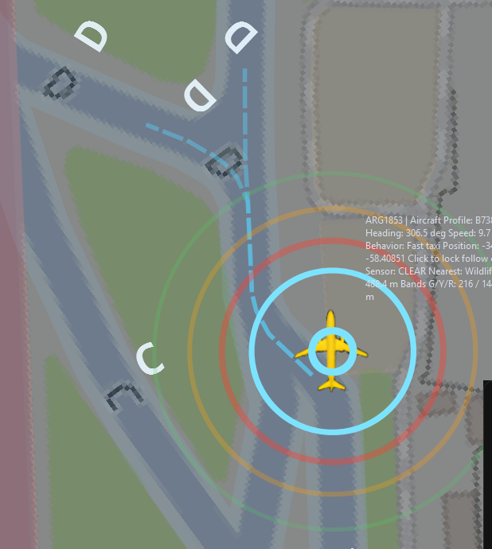
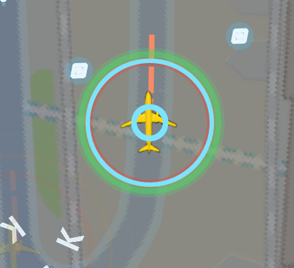
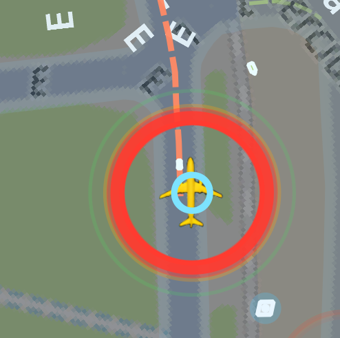
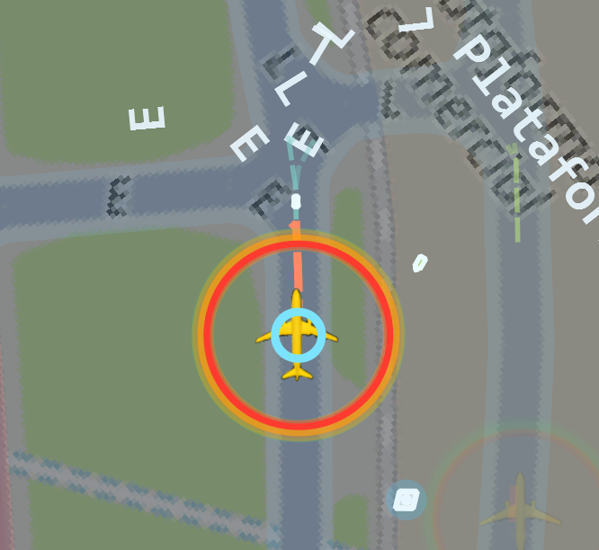

# Radar Inteligente de Superficie Aeroportuaria (RISA)

Sistema de vigilancia y prediccion de conflictos en superficie aeroportuaria, con visualizacion GIS, fusion de telemetria y monitoreo en tiempo real para aeronaves y vehiculos de apoyo (GSE).

## Objetivo

RISA busca mejorar la conciencia situacional en plataforma, calles de rodaje y pista mediante:

- Seguimiento de trafico en superficie con datos de telemetria.
- Prediccion de trayectorias en la red de movimiento aeroportuaria.
- Deteccion temprana de conflictos entre aeronaves, vehiculos y obstaculos.
- Visualizacion interactiva tipo radar con enfoque operativo.

## Funcionalidades principales

- Vista GIS de aeropuerto con overlays por sectores (runway, taxiway, apron).
- Modo torre (north-up) y modo cockpit AMMD (track-up).
- Alertas predictivas por severidad y TTC (time-to-conflict).
- Editor de reglas de seguridad (distancias por tipo, sector y velocidad).
- Editor de ajuste de zonas (buffer y opacidad por sector).
- Soporte de trafico en tierra simulado: vehiculos, FOD y wildlife.
- Dibujos diferenciados por tipo de vehiculo en el radar.

## Galeria de resultados

Las siguientes capturas muestran el comportamiento operativo del radar en escenarios de conflicto y seguimiento.

Guarda tus imagenes en docs/images con estos nombres para mantener la galeria sincronizada:

- 01-ruta-directa-alerta.png
- 02-rama-predictiva-alerta.png
- 03-anillo-critico.png
- 04-anillo-estable.png
- 05-tooltip-operativo.png
- 06-contexto-zoom-out.png

### 1) Ruta directa con alerta de proximidad


Lectura: aeronave seleccionada con halo cian y anillo rojo dominante, indicando condicion de riesgo en el entorno inmediato mientras sigue una trayectoria proyectada la cual al encontrarse el color anaranjado indica una posible colision.

### 2) Prediccion de ramas de trayectoria



Lectura: se observan ramificaciones punteadas en naranja que representan alternativas de movimiento en nodos cercanos de la red de rodaje.

### 3) Estado critico consolidado



Lectura: anillo rojo amplio y persistente con capas externas de referencia, util para priorizacion visual de amenazas en tiempo real.

### 4) Estado estable con margen de seguridad



Lectura: predominio de anillos cian y verde, con menor presencia de niveles de riesgo altos, asociado a una situacion de menor conflicto.

### 5) Tooltip operativo con contexto de sensor


Lectura: panel emergente con callsign, heading, speed, comportamiento, y resumen de sensor (objeto mas cercano y bandas G/Y/R).

### 6) Vista de contexto (zoom out)



Lectura: vista amplia para entender la posicion relativa de la aeronave respecto al entramado de calles y sectores del aeropuerto.

## Interpretacion visual rapida

- Halo cian: actor seleccionado o en seguimiento.
- Trazos punteados: trayectoria predictiva y posibles ramas.
- Anillo verde: zona de margen seguro.
- Anillo amarillo: advertencia temprana.
- Anillo rojo: condicion critica o conflicto de alta prioridad.

## Stack tecnologico

- Python 3.11+
- PySide6 (GUI)
- Shapely (geometrias)
- NetworkX (grafo de rutas)
- Geopy (calculos geodesicos)
- Requests (telemetria OpenSky)

## Estructura del proyecto

```text
asmgcs/
  app/
  domain/
  fusion/
  infrastructure/
  physics/
  viewmodels/
  views/
data/
img/
tests/
main.py
```

## Instalacion

```bash
python -m venv .venv
.venv\\Scripts\\activate
pip install -r requirements.txt
```

## Ejecucion

```bash
python main.py
```

## Telemetria OpenSky (opcional)

Puedes usar credenciales por variables de entorno:

- `OPENSKY_USERNAME`
- `OPENSKY_PASSWORD`

O OAuth client credentials:

- `OPENSKY_CLIENT_ID`
- `OPENSKY_CLIENT_SECRET`

Si no hay acceso online, el sistema puede apoyarse en datos de cache local para demo.

## Tests

```bash
python -m unittest discover -s tests
```

## Flujo de uso recomendado

1. Elegir aeropuerto desde el menu inicial.
2. Revisar trafico, predicciones y alertas en vista principal.
3. Probar modo cockpit seleccionando una aeronave.
4. Ajustar reglas en Safety Criteria.
5. Ajustar buffers/opacidad en Zone Polish.
6. Volver a simular y comparar comportamiento.

## Roadmap

- Exportacion de reportes de eventos y metricas.
- Integracion de mas fuentes de telemetria.
- Persistencia de configuraciones por escenario.
- Mejoras de UX para analisis post-operacion.

## Autor

Franco Agatiello

## Licencia

Define aqui la licencia del proyecto (por ejemplo, MIT).
